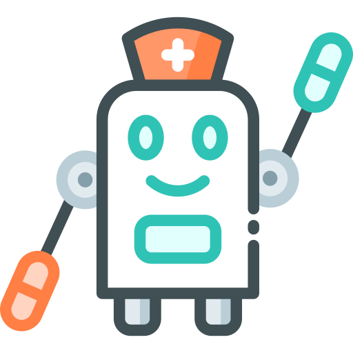

#  HealthBot - Patient Education ChatBot
Developing a RAG-powered chatbot to enhance patient education accessibility and improve outcomes for both patients and doctors

## :ledger: Index

- [About](#beginner-about)
- [Goals And Non-Goals](#scope_goals-and-non-goals)
- [Usage](#zap-usage)
- [Development](#wrench-development)
  - [Pre-Requisites](#notebook-pre-requisites)
  - [Data-Flow](#file-Data-Flow)
  - [Cost Analysis](#costing_cost-analysis) 
- [Impact and Risks](#question_impact-and-risks)
- [Resources](#page_facing_up-resources)
- [Gallery](#camera-gallery)

##  :beginner: About
Welcome to our Patient Education Chatbot, a cutting-edge tool designed to make high-quality patient education more accessible and improve health outcomes for both patients and healthcare providers.

In the ever-evolving healthcare industry, patient-centric care is paramount. Effective patient engagement is essential, and central to this is patient education. According to the American Academy of Family Physicians (AAFP), patient education involves "influencing patient behavior and producing the changes in knowledge, attitudes, and skills necessary to maintain or improve health."

Our chatbot is dedicated to empowering patients with the knowledge they need to manage their health effectively. 
Our goal is to transform patient education, making it more interactive, accessible, and effective. By using our Patient Education Chatbot, healthcare providers can foster better patient engagement, empower patients to take control of their health, and ultimately achieve better clinical outcomes. 
## 🔭 Goals And Non-Goals
✅ Goals  
● Help you feel comfortable with using AWS
services  
● Build an actual project using ChatGPT with
real-world datasets  
● Gain more experience as an E2E “Data &
LLM Solution Developer”  
● Share my view about the healthcare
industry & fostering discussion  
❌ Not in scope  
● Fine-tune a LLM  
● Use open-source LLMs and host them on
AWS  
● Become THE expert on AWS  
● Become THE expert in the healthcare 
industry  
## :zap: Usage
Using our HealthBot App is straightforward and user-friendly. Simply install it from the App Store or Android Store or download on your device and begin addressing your questions and concerns immediately.

## 🔧 Development

### :notebook: Pre-Requisites
List of the pre-requisites the system needs to develop this project.  
● AWS  
● GitHub  
● Docker  
● Lucidchart  
● LLM Toolkit (ChatGPT API, LangChain)  
● Groq (API) - free beta!  
● Voyage AI - embedding  
● Pinecone  
● NLTK  
● All sorts of APIs!  

### :file:  Data Flow

### 💵: Cost Analysis:
-> AWS (Amazon Web Services) : Upto $20  
-> OpenAI : Upto $20

## Impact and Risks
Impact:  
● Improved Patient Engagement 
● Enhanced Health Literacy 
● Better Health Outcomes 
● Increased Efficiency for Healthcare Providers 
● Scalability 
● Personalized Education 
● Continuous Support 

Risks: 
● Data Privacy and Security 
● Accuracy of Information 
● Over-reliance on Technology 
● Technical Issues 
● Bias and Inequality 
● Limited Scope 
● Misinterpretation of Advice 

##  :page_facing_up: Resources
PE for better outcome : https://www.techtarget.com/patientengagement/feature/Why-Patient-Education-Is-Vital-for-Engagement-Better-Outcomes  
PE in Nursing : https://nursingcecentral.com/the-importance-of-patient-education-in-nursing/  
AWS Lambda AWS S3 : https://docs.aws.amazon.com/lambda/latest/operatorguide/intro.html  
AWS CLI Installation : https://docs.aws.amazon.com/cli/latest/userguide/getting-started-install.html  
CCPA vs GDPR: An In-dept Comparison- Sprinto : https://sprinto.com/blog/ccpa-vs-gdpr/  
NLTK x NER (Named Entity Recognition) Introduction : https://fouadroumieh.medium.com/nlp-entity-extraction-ner-using-python-nltk-68649e65e54b  
How to create a lambda layer: https://jasondezhulo.notion.site/Create-Custom-Lambda-Layers-4883fd1da6104007852ea510518a216d  

##  :camera: Gallery TBD!
Pictures of the project.

